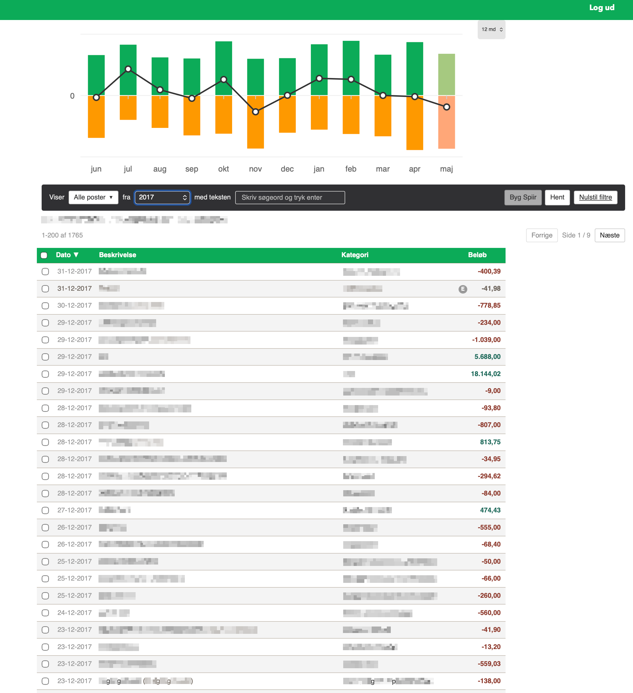
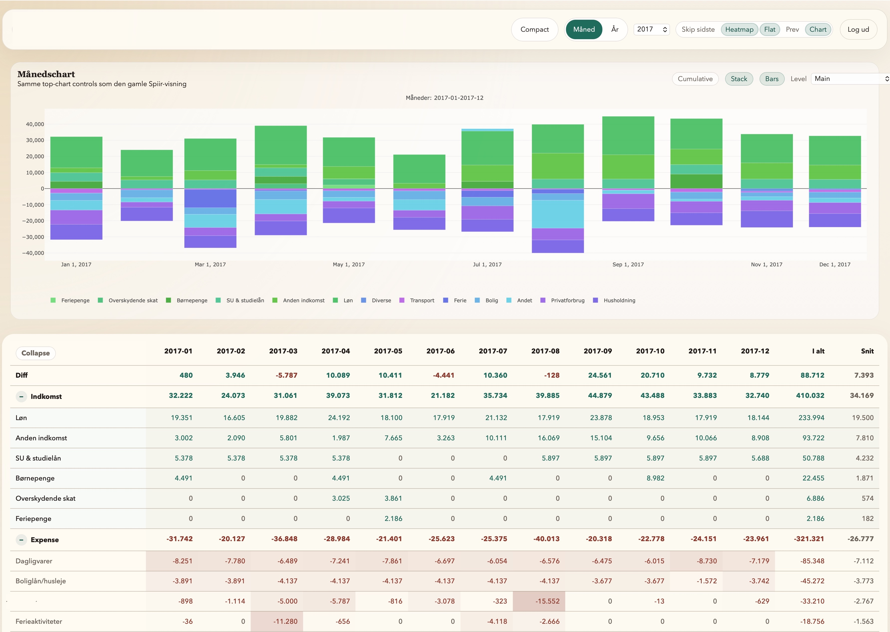
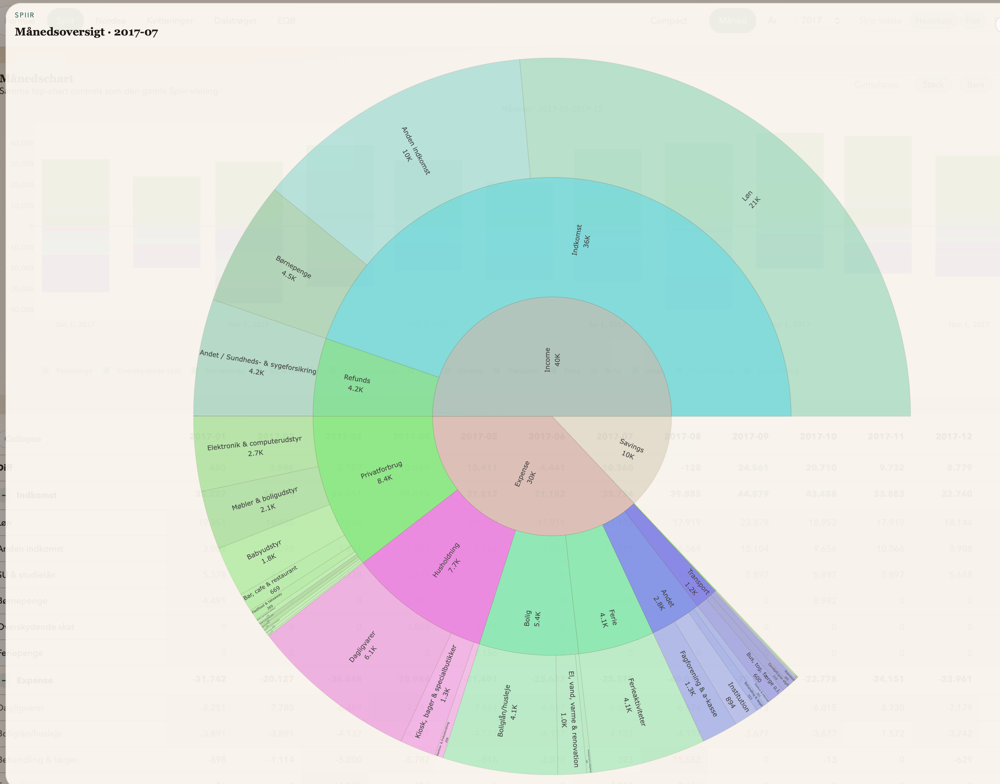
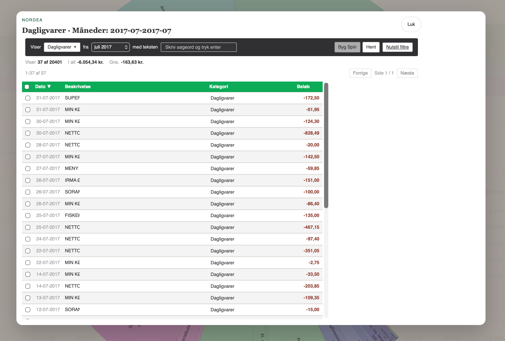
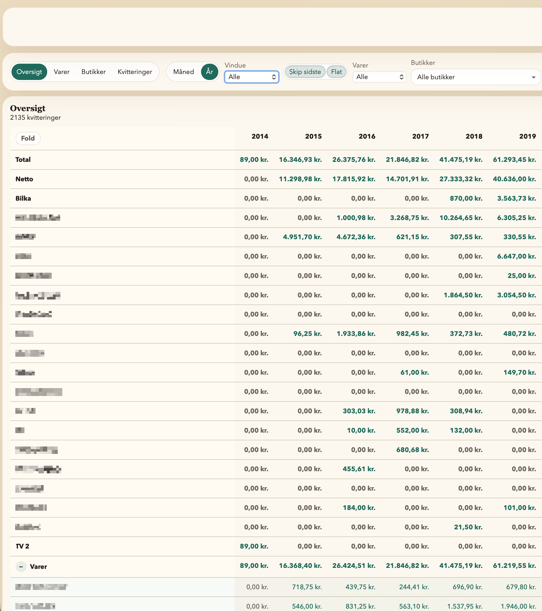

# Spiir Alternative Reference Export

This is a clean reference export of the reusable pieces from a private personal finance app. It is meant to show one practical approach to replacing a Spiir-style overview with local data:

1. fetch bank transactions through Enable Banking / Nordea
2. normalize them into a local ledger
3. attempt to categorize new Nordea rows from repeated historical ledger matches
4. save local category, note, hashtag, date, split, and review overrides
5. rebuild a Spiir-style income/expense overview from that local ledger
6. optionally import Storebox receipt JSON for receipt/item analysis

This is **not** a polished starter app. Treat it as a map and code archive for your own project.

The most important external setup is Enable Banking/Nordea access. Start with [docs/enable-banking.md](docs/enable-banking.md) if you want to make the bank fetch work.

Related Danish discussion: [r/dkfinance post](https://www.reddit.com/r/dkfinance/comments/1tpbb53/inspiration_til_selfhosted_spiiralternativ/).

## Screenshots

These show the kind of workflows the exported code supports.

### Nordea / Local Ledger Review



### Spiir-Style Monthly Overview



### Spiir Sunburst Drilldown



### Category Transaction Drilldown



### Storebox Receipt Overview



## What Is Included

- `backend/app/nordea_service.py`: Enable Banking/Nordea transaction fetch, raw storage, normalization, status, and taxonomy helpers.
- `backend/app/spiir_local_ledger_service.py`: local transaction ledger, override application, sync from Nordea, history-based category suggestions, split migration/repair, and paged transaction responses.
- `backend/app/spiir_service.py`: Spiir-style processed overview, income/expense series, rebuild state, hashtag helpers, and summary output.
- `backend/app/local_ledger_overrides.py`: shared override normalization/application rules.
- `backend/app/kvitteringer_service.py`: Storebox receipt import, SQLite indexes, item clustering, category overrides, and receipt/Spiir linking helpers.
- `backend/app/reference_api.py`: slim FastAPI route wiring for the exported modules.
- `backend/app/config.py` and `backend/app/storage.py`: small generic replacements for private app config/storage.
- `frontend/src/*Dashboard.tsx`: copied React UI surfaces for Nordea/local-ledger review, overview, and receipts.
- `frontend/src/api.ts`, `frontend/src/types.ts`, and helpers: the API client and shared frontend types used by those dashboards.
- `scripts/enablebanking_probe.py`: a local helper for listing banks, creating an auth URL, exchanging a consent code, and fetching transactions.

## Privacy Rules

This repo is meant to contain reusable code and redacted examples only.

## Start Here

1. If you still have Spiir access, download the full postings export first.
2. Read [docs/enable-banking.md](docs/enable-banking.md) and create the Enable Banking app/key.
3. Copy `env.example` to `.env`, replace placeholders, then source it in your shell.
4. Install the backend and call `/api/status` to verify local storage paths.
5. Import the Spiir export, then use `scripts/enablebanking_probe.py` to fetch new bank transactions.
6. Start the frontend after the backend has data to show.

## Seed From Existing Spiir Data

Before Spiir disappears, download your full postings dataset if you can. This gives you historical transactions and a useful category history for matching future Nordea rows. During Nordea sync, uncategorized new rows can be assigned a category when matching historical rows agree strongly enough.

Save the downloaded JSON as:

```text
data/spiir/raw/all_entries.json
```

Then run the reference API and import it into the local ledger:

```bash
curl http://127.0.0.1:8000/api/spiir/local-ledger/preview
curl -X POST http://127.0.0.1:8000/api/spiir/local-ledger/apply
curl -X POST http://127.0.0.1:8000/api/spiir/rebuild-from-local
```

The export downloader itself is not part of this reference repo. The reusable import code starts from `data/spiir/raw/all_entries.json`.

## Backend Setup

Use Python 3.11 or newer.

From this folder:

```bash
python3 -m venv .venv
source .venv/bin/activate
pip install -r backend/requirements.txt
```

Useful environment variables:

```bash
export SPIIR_ALT_DATA_DIR="$PWD/data"
export ENABLEBANKING_APP_ID="your-enable-banking-app-id"
export ENABLEBANKING_PRIVATE_KEY_PATH="$PWD/data/local_secrets/enablebanking/$ENABLEBANKING_APP_ID.pem"
export ENABLEBANKING_REDIRECT_URL="https://your-domain.example/enablebanking/callback"
export SPIIR_CUTOVER_DATE="2026-01-01"
```

Or use the template:

```bash
cp env.example .env
# edit .env first
set -a
source .env
set +a
```

Run the reference API:

```bash
uvicorn app.reference_api:app --app-dir backend --reload --port 8000
```

This reference API intentionally has no auth gate, because the point is to show the relevant routes. Do not expose it directly. Put a password/session layer in front of it before real use.

## Enable Banking Setup

The crucial external part is getting Enable Banking working with a restricted production app for your own accounts. See the full guide: [docs/enable-banking.md](docs/enable-banking.md).

Minimal command path after you have created the app, saved the private key, linked your accounts, and exported the env vars above:

```bash
source .venv/bin/activate
python scripts/enablebanking_probe.py aspsps
python scripts/enablebanking_probe.py auth-url --days 170
```

Open the printed URL, approve access in Nordea, then copy the `code` query parameter from the redirect URL:

```bash
python scripts/enablebanking_probe.py session --code "PASTE_CODE_HERE"
```

That writes `data/transactions/enablebanking/latest_session.json`. The backend fetcher reads that session and calls `/accounts/{uid}/transactions` for each linked account.

Fetch the first account manually with the longest available history:

```bash
python scripts/enablebanking_probe.py transactions --account-index 0 --strategy longest
```

API-driven fetch:

```bash
curl -X POST http://127.0.0.1:8000/api/nordea/retrieve/start
curl http://127.0.0.1:8000/api/nordea/retrieve/status
```

Then sync Nordea rows into the local ledger and rebuild the overview:

```bash
curl -X POST http://127.0.0.1:8000/api/spiir/local-ledger/nordea-sync/apply
curl -X POST http://127.0.0.1:8000/api/spiir/rebuild-from-local
```

## Frontend Setup

```bash
cd frontend
npm install
npm run dev
```

The copied frontend assumes API routes under `/api/...`. In a real app, run Vite with a proxy to the FastAPI backend or serve the built frontend behind the same origin.

## Storebox / Receipts Setup

If you export Storebox receipt JSON, place it outside git and point `STOREBOX_SOURCE_DIR` at it:

```bash
export STOREBOX_SOURCE_DIR="$PWD/data/storebox"
```

Then import or rebuild:

```bash
curl -X POST http://127.0.0.1:8000/api/kvitteringer/import/default
curl -X POST http://127.0.0.1:8000/api/kvitteringer/rebuild
```

## Known Gaps

- no fake sample dataset yet; dashboards need fetched/imported local data before they become useful
- reference API has no auth gate; add one before exposing it beyond your own machine
- frontend surfaces are copied from the working app and still larger than a clean starter UI
- API paths still use Spiir/Nordea naming because they mirror the original replacement flow
- license choice is not included yet; add one before encouraging broad reuse
